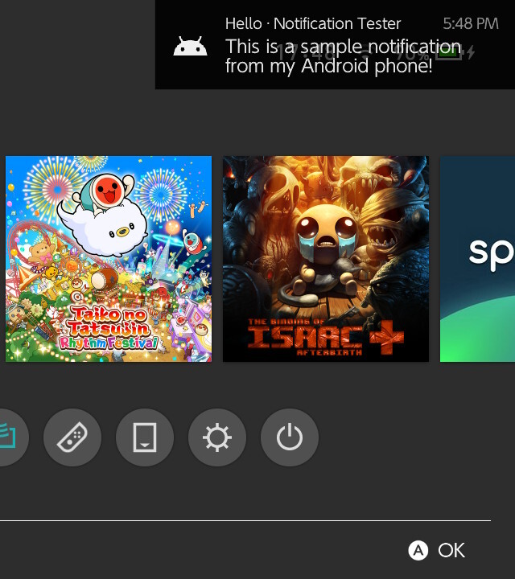
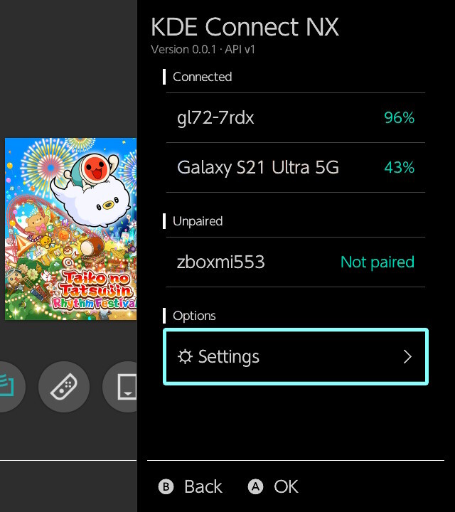
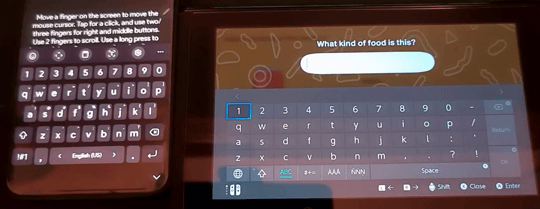
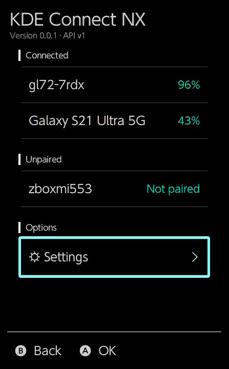
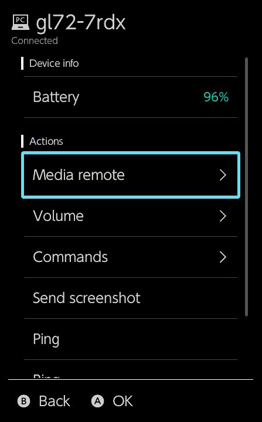
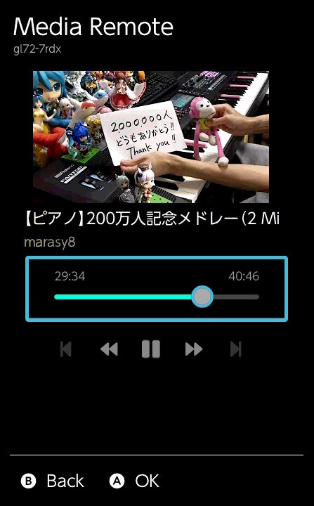
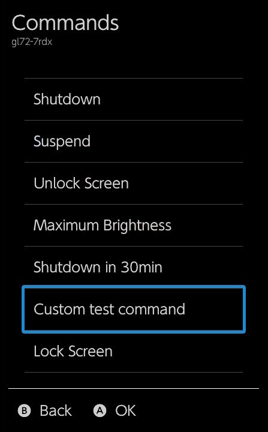
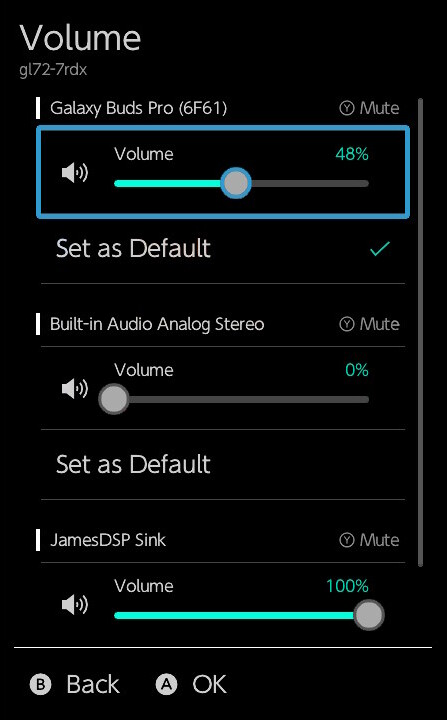
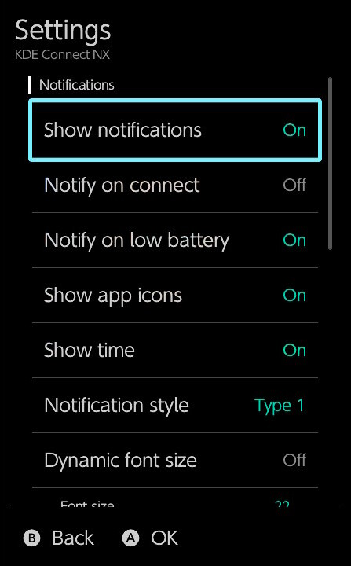

# KDE Connect NX

A lightweight [KDE Connect](https://kdeconnect.kde.org/) implementation for the Nintendo Switch written from scratch.
Runs as a background sysmodule with an Ultrahand overlay, and pairs with any KDE Connect client present in the same local network.

  
  

More screenshots [below](#screenshots).

## Features

Not all KDE Connect plugins are implemented. Some plugins are only implemented in one direction.

From your phone, tablet, PC to your Switch:

- **Receive notifications (from Android/PC)**
- **Remote keyboard**
  - Inject USB keyboard strokes on the Switch from another device
  - (Limitation: An US English USB keyboard is simulated, so only characters present on a US keyboard can be injected.)
- **Remote commands**
  - Control the Switch with some hardcoded commands (power control, send screenshot to PC/phone, etc.)
- **Volume control**
  - Remote control the master volume level of your Switch
- **File transfer**
  - Send files to your Switch's SD card

From your Switch to your other devices:

- **Media playback remote controls**
- **Remote commands (PC only)**
  - Trigger predefined commands on a connected PC (custom shell commands; requires setup on the PC)
- **Audio output control (PC only)**
  - Remotely choose between audio devices and set the volume level for each one
- **Send screenshot**
  - Take a screenshot and send it to a device
- **Ring device**

In both directions:

- **Battery status**
- **Ping devices** (for testing)

## Installation

* Install the [Ultrahand-Overlay](https://github.com/ppkantorski/Ultrahand-Overlay), if you haven't already
  * Ultrahand is a fork of Tesla. Tesla does not support notifications and is not compatible with this application! 
* Download the [latest release](https://github.com/timschneeb/kdeconnect-nx/releases) of this project
* Extract the ZIP on the SD card of your Switch
* Reboot

### Connecting to other devices

* Visit this page to install KDE Connect on your other devices: https://kdeconnect.kde.org/download.html
* The KDE Connect clients will automatically discover each other.
* Open the overlay named 'KDE Connect NX' via Ultrahand
* After starting the pairing process in the overlay, you need to accept the pair request within 30 seconds.

Connection problems? (Click here to expand)

>* Your devices must be connected to the same WiFi network
>* Some networks (espacially public or shared ones) have client isolation enabled; KDE Connect will not be able to communicate with other devices on these networks.
>* The system time on your Switch must be correct to pair devices, otherwise the SSL certificate exchange will fail. If you have updated the system time, you need to restart the sysmodule to apply the change to it.

  
>[!IMPORTANT]
>Please note that some features are not implemented on all platforms. 
>You will have the best experience with Android & Linux. The Windows client is also very capable. 
>
>For macOS there is currently only a nightly version available, and on iOS the implementation is very limited due to Apple's locked down ecosystem (it cannot run in background at all).

## Screenshots
<table>
  <tr>
    <td></td>
  </tr>
  <tr>
    <td align="center">Remote keyboard input</td>
  </tr>
</table>

<table>
  <tr>
    <td></td>
    <td></td>
    <td></td>
  </tr>
  <tr>
    <td align="center">Device list</td>
    <td align="center">Device actions</td>
    <td align="center">Media remote</td>
  </tr>
  <tr>
    <td></td>
    <td></td>
    <td></td>
  </tr>
  <tr>
    <td align="center">Remote commands</td>
    <td align="center">Volume control</td>
    <td align="center">Settings</td>
  </tr>
</table>

## Building from sources

Refer to [BUILDING.md](BUILDING.md) for detailed build instructions and development environment setup recommendations.

## License

Licensed under GPLv3.

Exceptions:
* `sysmodule/src/ipc/ipc_server.*`: THE BEER-WARE LICENSE (Thanks to [retronx-team](https://github.com/retronx-team/sys-clk)!)
* `tools/nxlink.c`: ISC license (Thanks to [switchbrew](https://github.com/switchbrew/switch-tools)!)
