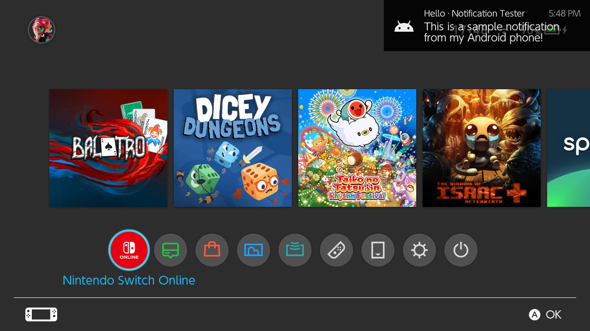

# KDE Connect NX

A lightweight [KDE Connect](https://kdeconnect.kde.org/) implementation for the Nintendo Switch written from scratch.
Runs as a background sysmodule with an Ultrahand overlay, and pairs with any KDE Connect client present in the same local network.

<table>
  <tr>
    <td></td>
    <td></td>
  </tr>
</table>

## Features

Not all KDE Connect plugins are implemented. Some plugins are only implemented in one direction.

From your phone, tablet, PC to your Switch:

- **Receive notifications (from Android/PC)**
- **Remote keyboard**
  - Inject USB keyboard strokes on the Switch from another device
  - (Limitation: An US English USB keyboard is simulated, so only characters present on a US keyboard can be injected.)
- **Remote commands**
  - Control the Switch with some hardcoded commands (power control, send screenshot to PC/phone, etc.)
- **Volume control**
  - Remote control the master volume level of your Switch
- **File transfer**
  - Send files to your Switch's SD card

From your Switch to your other devices:

- **Media playback remote controls**
- **Remote commands (PC only)**
  - Trigger predefined commands on a connected PC (custom shell commands; requires setup on the PC)
- **Audio output control (PC only)**
  - Remotely choose between audio devices and set the volume level for each one
- **Send screenshot**
  - Take a screenshot and send it to a device
- **Ring device**

In both directions:

- **Battery status**
- **Ping devices** (for testing)

## Screenshots

<table>
  <tr>
    <td></td>
    <td></td>
    <td></td>
  </tr>
  <tr>
    <td align="center">Device list</td>
    <td align="center">Device actions</td>
    <td align="center">Remote commands</td>
  </tr>
  <tr>
    <td></td>
    <td></td>
    <td></td>
  </tr>
  <tr>
    <td align="center">Media remote</td>
    <td align="center">Volume control</td>
    <td align="center">Settings</td>
  </tr>
</table>

Notifications appear as a pop-up:

## Building from sources

Refer to [BUILDING.md](BUILDING.md) for detailed build instructions and development environment setup recommendations.

## License

Licensed under GPLv3.

Exceptions:
* `sysmodule/src/ipc/ipc_server.*`: THE BEER-WARE LICENSE (Thanks to [retronx-team](https://github.com/retronx-team/sys-clk)!)
* `tools/nxlink.c`: ISC license (Thanks to [switchbrew](https://github.com/switchbrew/switch-tools)!)
